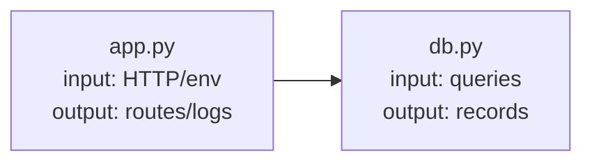

# Repo Visualizer

## Overview

Create a navigable, human-readable architecture snapshot of the non-test code in the current repository. The output is a self-contained HTML page at `docs/repo_structure.html` that future maintainers can scan and click through.

This skill is for human comprehension. Do not replace it with a raw node graph when the user wants readable documentation.

## When to Use

- User says "update docs", "visualize codebase", "show repo structure", "map codebase", "document how files connect", "code walkthrough", or asks for `docs/repo_structure.html`.
- Use for source-code repositories where file relationships, script internals, and maintainer-readable summaries matter.
- Do not use for test-only reviews, generated/vendor code, or broad architecture refactoring recommendations.
- If the user explicitly asks for Graphify or `graphify-out`, use the Graphify skill instead.

## Workflow

1. Inspect repo orientation files first: README, package/project manifests, build/config files, and existing docs.
2. Inventory non-test source code. Exclude `test`, `tests`, `__tests__`, `spec`, `e2e`, fixtures, snapshots, coverage, build/dist, vendored dependencies, caches, and generated output unless they are the product being documented.
3. Read the code files, prioritizing entry points, config, scripts, and modules imported by other files. Do not infer details from filenames alone.
4. Build a file graph from imports/requires/includes, CLI or config entry references, and obvious runtime calls. Label uncertain or dynamic edges as `dynamic/indirect` instead of inventing certainty.
5. For each included code file, identify purpose, inputs, outputs, key functions/classes, and key module-level variables/constants/state.
6. Generate `docs/repo_structure.html`, creating `docs/` if needed. Regenerate from source when updating; do not patch stale facts by hand.
7. Open the local HTML page and verify Mermaid renders, file clicks change the details panel, text is readable, and there are no script errors. For `file://` pages, prefer Chrome DevTools MCP when available.

## File Details

For every included code file, capture:

| Field | What to Record |
|---|---|
| Purpose | One sentence describing the file's role |
| Inputs | CLI args, env vars, files, network/DB/user input, imported APIs |
| Outputs | Files, stdout/logs, network/DB writes, exports, rendered UI, side effects |
| Functions/classes | Name, purpose, important params, return value or effect |
| Variables/constants | Module-level config, exported state, flags, and values that shape behavior |

## HTML Requirements

- Self-contained HTML/CSS/JS except Mermaid may load from CDN.
- Include a Mermaid graph showing code files and links. Use compact file labels and edge labels for import/call/config relationships.
- Make each script/code file clickable from both the graph and a file list. Clicking shows that file's details in a side panel or main panel.
- For Mermaid callbacks, initialize Mermaid with `securityLevel: "loose"` and expose the handler on `window`, for example `window.selectFile = selectFile`.
- Include a summary section with project inputs, project outputs, main entry points, and omitted test/generated paths.
- Use stable element IDs derived from paths, escape all code text for HTML/JS, and keep the page usable without a build step.

## Mermaid Pattern



Pair it with JavaScript data:

```js
const files = {
  "app.py": {
    purpose: "...",
    inputs: ["..."],
    outputs: ["..."],
    functions: [{ name: "main", purpose: "..." }],
    variables: [{ name: "CONFIG", purpose: "..." }]
  }
};
```

## Quality Bar

- Prefer accurate partial coverage over broad invented coverage.
- Keep tests out of the main graph; mention excluded test areas only in the omitted paths section.
- If a file is large, summarize stable public behavior before private helpers.
- If the repo uses multiple languages, document each by its actual dependency mechanism.
- If verification cannot run, state exactly what was generated and what was not verified.
