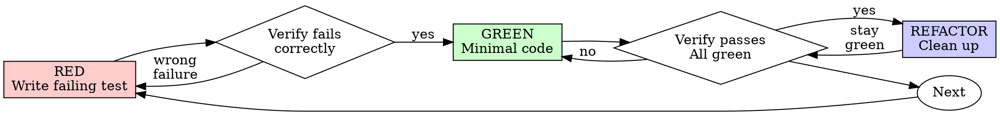

# Test-Driven Development (TDD)

## Overview

Write the test first. Watch it fail. Write minimal code to pass.

**Core principle:** If you didn't watch the test fail, you don't know if it tests the right thing.

**Violating the letter of the rules is violating the spirit of the rules.**

## Timeout Rule

Every test run MUST have a timeout. This is a first-class TDD rule, not an optional safety net.

If a test command can hang, the agent can hang with it. Never run bare `npm test`, `pytest`, `go test`, `cargo test`, `vitest`, `jest`, `bun test`, `deno test`, or similar commands without a timeout around the process.

**Use an external timeout that kills the stuck process, not just an in-test assertion timeout.** Runner-level test timeouts help, but they do not replace a command-level timeout.

**Reasonable defaults:**
- Single test / focused RED or GREEN check: 30-60 seconds
- Small package or file-level suite: 2-5 minutes
- Full project suite: 5-15 minutes

If a command times out, treat that as a failure that must be debugged. Do not re-run the same hanging command indefinitely.

## What to Test: Requirements First

Tests should be derived from **user requirements**, not from implementation details.

If the spec has "User Requirements" and "Agent Design Decisions" sections (from the brainstorming skill), the user requirements drive the primary test suite. Each user requirement should have at least one test that verifies the feature works **as the user described it** — from the outside, testing behavior and outcomes.

Agent design decisions get lighter testing. They're often covered implicitly by the user-requirement tests. Don't write separate tests for internal functions just because they exist.

**Test hierarchy:**
1. **User-requirement tests** — verify the features the user asked for, from the user's perspective. These are the tests that matter most.
2. **Edge case / error tests** — cover failure modes and boundaries of the above.
3. **Implementation tests** — only when the internal behavior is complex enough to warrant direct verification. Ask: "would the user care if this worked differently internally?" If no, you probably don't need a dedicated test for it.

**The test for "login redirects to dashboard" is not `expect(generateToken()).toBeString()`.** It's `expect(afterLogin().currentPage).toBe('/dashboard')`. Test the feature, not the plumbing.

## When to Use

**Always:**
- New features
- Bug fixes
- Refactoring
- Behavior changes

**Exceptions (ask your human partner):**
- Throwaway prototypes
- Generated code
- Configuration files

Thinking "skip TDD just this once"? Stop. That's rationalization.

## The Iron Law

```
NO PRODUCTION CODE WITHOUT A FAILING TEST FIRST
```

Write code before the test? Delete it. Start over.

**No exceptions:**
- Don't keep it as "reference"
- Don't "adapt" it while writing tests
- Don't look at it
- Delete means delete

Implement fresh from tests. Period.

## Red-Green-Refactor



### RED - Write Failing Test

Write one minimal test showing what should happen.

<Good>
```typescript
test('retries failed operations 3 times', async () => {
  let attempts = 0;
  const operation = () => {
    attempts++;
    if (attempts < 3) throw new Error('fail');
    return 'success';
  };

  const result = await retryOperation(operation);

  expect(result).toBe('success');
  expect(attempts).toBe(3);
});
```
Clear name, tests real behavior, one thing
</Good>

<Bad>
```typescript
test('retry works', async () => {
  const mock = jest.fn()
    .mockRejectedValueOnce(new Error())
    .mockRejectedValueOnce(new Error())
    .mockResolvedValueOnce('success');
  await retryOperation(mock);
  expect(mock).toHaveBeenCalledTimes(3);
});
```
Vague name, tests mock not code
</Bad>

**Requirements:**
- One behavior
- Clear name
- Real code (no mocks unless unavoidable)

### Verify RED - Watch It Fail

**MANDATORY. Never skip.**

```bash
timeout 45s npm test path/to/test.test.ts
```

Use your shell's equivalent external timeout wrapper if `timeout` is unavailable.

Confirm:
- Test fails (not errors)
- Failure message is expected
- Fails because feature missing (not typos)
- Command did not hang past the timeout

**Test passes?** You're testing existing behavior. Fix test.

**Test errors or times out?** Fix the issue, then re-run until it fails correctly.

### GREEN - Minimal Code

Write simplest code to pass the test.

<Good>
```typescript
async function retryOperation<T>(fn: () => Promise<T>): Promise<T> {
  for (let i = 0; i < 3; i++) {
    try {
      return await fn();
    } catch (e) {
      if (i === 2) throw e;
    }
  }
  throw new Error('unreachable');
}
```
Just enough to pass
</Good>

<Bad>
```typescript
async function retryOperation<T>(
  fn: () => Promise<T>,
  options?: {
    maxRetries?: number;
    backoff?: 'linear' | 'exponential';
    onRetry?: (attempt: number) => void;
  }
): Promise<T> {
  // YAGNI
}
```
Over-engineered
</Bad>

Don't add features, refactor other code, or "improve" beyond the test.

### No Fallbacks, No Silent Failure

<HARD-GATE>
Never write fallback code, default returns, or silent error swallowing to make a test pass. If the feature doesn't work, the code must fail explicitly.
</HARD-GATE>

**The problem:** The agent writes a test, then writes implementation code that returns a default value, catches and ignores errors, or adds a fallback path that makes the test green without actually implementing the feature. The test passes. The feature doesn't work.

<Bad>
```typescript
// Test: "search returns matching results"
// Implementation that games the test:
function search(query: string): Result[] {
  try {
    return database.search(query);
  } catch {
    return [];  // ← Fallback: test passes, feature silently broken
  }
}
```
</Bad>

<Good>
```typescript
// Implementation that fails explicitly:
function search(query: string): Result[] {
  return database.search(query);
  // If database.search throws, the error propagates.
  // The test fails. You know something is wrong.
}
```
</Good>

**Rules:**
- If you can't implement the feature, let the test fail. Don't fake it.
- Error handling is for expected error cases the user would encounter, not for masking incomplete implementations.
- A test that passes because of a fallback is worse than a test that fails — the failure tells you the truth, the fallback hides it.
- If you're adding a try/catch, default return, or `?? fallbackValue` to make a test green, stop and ask: "would this code work correctly in production, or am I just making the test pass?"

**When the planned approach doesn't work:**
If the implementation approach specified in the plan keeps failing, do NOT silently switch to an alternative. Stop and suggest alternatives to the user. The user decides which direction to take, not the agent.

**Version upgrades (v1 → v2):**
When the user asks to upgrade, expand, or replace an existing feature (v1) with a new version (v2):
- **Remove or update v1 tests first.** Stale v1 tests that assert old behavior will cause the agent to re-implement v1 as a "fallback" to make them pass. Delete tests for v1 behavior that v2 intentionally changes.
- **Never create `if v2 fails, fall back to v1` code** unless the user explicitly asks for backward compatibility. The user chose v2. v1 is no longer the requirement.
- **Write new tests for v2 behavior.** The test suite should reflect what the user wants now, not what existed before.
- If v2 can't be implemented as described, surface the problem. Don't silently preserve v1.

### Verify GREEN - Watch It Pass

**MANDATORY.**

```bash
timeout 45s npm test path/to/test.test.ts
```

Use your shell's equivalent external timeout wrapper if `timeout` is unavailable.

Confirm:
- Test passes
- Other tests still pass
- Output pristine (no errors, warnings)
- Command completed before the timeout

**Test fails?** Fix code, not test.

**Other tests fail or the command times out?** Fix now.

### REFACTOR - Clean Up

After green only:
- Remove duplication
- Improve names
- Extract helpers

Keep tests green. Don't add behavior.

### Repeat

Next failing test for next feature.

## Good Tests

| Quality | Good | Bad |
|---------|------|-----|
| **Minimal** | One thing. "and" in name? Split it. | `test('validates email and domain and whitespace')` |
| **Clear** | Name describes behavior | `test('test1')` |
| **Shows intent** | Demonstrates desired API | Obscures what code should do |

## Why Order Matters

**"I'll write tests after to verify it works"**

Tests written after code pass immediately. Passing immediately proves nothing:
- Might test wrong thing
- Might test implementation, not behavior
- Might miss edge cases you forgot
- You never saw it catch the bug

Test-first forces you to see the test fail, proving it actually tests something.

**"I already manually tested all the edge cases"**

Manual testing is ad-hoc. You think you tested everything but:
- No record of what you tested
- Can't re-run when code changes
- Easy to forget cases under pressure
- "It worked when I tried it" ≠ comprehensive

Automated tests are systematic. They run the same way every time.

**"Deleting X hours of work is wasteful"**

Sunk cost fallacy. The time is already gone. Your choice now:
- Delete and rewrite with TDD (X more hours, high confidence)
- Keep it and add tests after (30 min, low confidence, likely bugs)

The "waste" is keeping code you can't trust. Working code without real tests is technical debt.

**"TDD is dogmatic, being pragmatic means adapting"**

TDD IS pragmatic:
- Finds bugs before commit (faster than debugging after)
- Prevents regressions (tests catch breaks immediately)
- Documents behavior (tests show how to use code)
- Enables refactoring (change freely, tests catch breaks)

"Pragmatic" shortcuts = debugging in production = slower.

**"Tests after achieve the same goals - it's spirit not ritual"**

No. Tests-after answer "What does this do?" Tests-first answer "What should this do?"

Tests-after are biased by your implementation. You test what you built, not what's required. You verify remembered edge cases, not discovered ones.

Tests-first force edge case discovery before implementing. Tests-after verify you remembered everything (you didn't).

30 minutes of tests after ≠ TDD. You get coverage, lose proof tests work.

## Common Rationalizations

| Excuse | Reality |
|--------|---------|
| "Too simple to test" | Simple code breaks. Test takes 30 seconds. |
| "I'll test after" | Tests passing immediately prove nothing. |
| "Tests after achieve same goals" | Tests-after = "what does this do?" Tests-first = "what should this do?" |
| "Already manually tested" | Ad-hoc ≠ systematic. No record, can't re-run. |
| "Deleting X hours is wasteful" | Sunk cost fallacy. Keeping unverified code is technical debt. |
| "Keep as reference, write tests first" | You'll adapt it. That's testing after. Delete means delete. |
| "Need to explore first" | Fine. Throw away exploration, start with TDD. |
| "Test hard = design unclear" | Listen to test. Hard to test = hard to use. |
| "TDD will slow me down" | TDD faster than debugging. Pragmatic = test-first. |
| "Manual test faster" | Manual doesn't prove edge cases. You'll re-test every change. |
| "Existing code has no tests" | You're improving it. Add tests for existing code. |
| "This test command usually finishes quickly" | Usually is not good enough. Add a timeout anyway. |
| "The runner has its own timeout" | Runner-level timeout does not guarantee the whole process exits. |

## Red Flags - STOP and Start Over

- Code before test
- Test after implementation
- Test passes immediately
- Can't explain why test failed
- Tests added "later"
- Rationalizing "just this once"
- "I already manually tested it"
- "Tests after achieve the same purpose"
- "It's about spirit not ritual"
- "Keep as reference" or "adapt existing code"
- "Already spent X hours, deleting is wasteful"
- "TDD is dogmatic, I'm being pragmatic"
- "This is different because..."
- Test passes because of a fallback/default/stub, not because the feature works
- Test verifies an implementation detail no user would care about
- Writing tests for every internal function instead of testing user-facing behavior
- Running test commands without an explicit timeout
- Re-running the same hanging test command without changing anything

**All of these mean: Delete code. Start over with TDD.**

## Example: Bug Fix

**Bug:** Empty email accepted

**RED**
```typescript
test('rejects empty email', async () => {
  const result = await submitForm({ email: '' });
  expect(result.error).toBe('Email required');
});
```

**Verify RED**
```bash
$ timeout 45s npm test
FAIL: expected 'Email required', got undefined
```

**GREEN**
```typescript
function submitForm(data: FormData) {
  if (!data.email?.trim()) {
    return { error: 'Email required' };
  }
  // ...
}
```

**Verify GREEN**
```bash
$ timeout 45s npm test
PASS
```

**REFACTOR**
Extract validation for multiple fields if needed.

## Verification Checklist

Before marking work complete:

- [ ] Every user requirement has at least one behavioral test
- [ ] Tests verify features from the user's perspective, not implementation internals
- [ ] Watched each test fail before implementing
- [ ] Each test failed for expected reason (feature missing, not typo)
- [ ] Wrote minimal code to pass each test
- [ ] No fallbacks, default returns, or silent error swallowing to make tests green
- [ ] All tests pass
- [ ] Output pristine (no errors, warnings)
- [ ] Every test command was run with a reasonable timeout
- [ ] Tests use real code (mocks only if unavoidable)
- [ ] Edge cases and errors covered

Can't check all boxes? You skipped TDD. Start over.

## When Stuck

| Problem | Solution |
|---------|----------|
| Don't know how to test | Write wished-for API. Write assertion first. Ask your human partner. |
| Test too complicated | Design too complicated. Simplify interface. |
| Must mock everything | Code too coupled. Use dependency injection. |
| Test setup huge | Extract helpers. Still complex? Simplify design. |
| Test command hangs | Stop running it bare. Add or shorten the timeout, isolate the stuck test, and debug the hang as a real failure. |

## Debugging Integration

Bug found? Write failing test reproducing it. Follow TDD cycle. Test proves fix and prevents regression.

Never fix bugs without a test.

## Testing Anti-Patterns

When adding mocks or test utilities, read @testing-anti-patterns.md to avoid common pitfalls:
- Testing mock behavior instead of real behavior
- Adding test-only methods to production classes
- Mocking without understanding dependencies

## Final Rule

```
Production code → test exists and failed first
Otherwise → not TDD
```

No exceptions without your human partner's permission.
